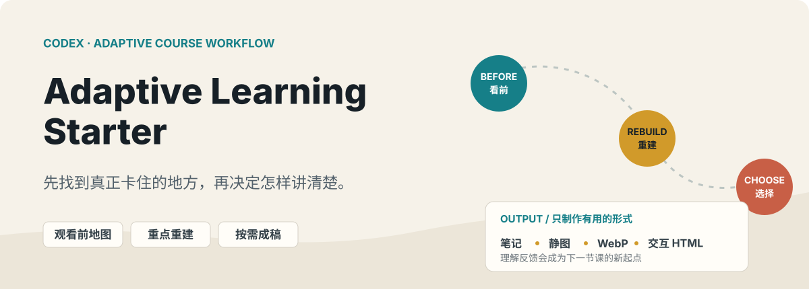
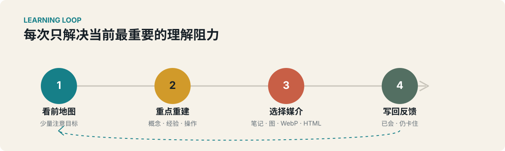

<p align="center">
  
</p>

# Adaptive Learning Starter

给 Codex 一套可逐步调教的课程学习方法。它不替你堆摘要，而是先找出真正需要理解的部分，再为每个难点选择合适的表达方式。

> 适合视频课程、网页课件、PDF 与其他连续学习资料。不限学科，也不绑定 Blender、Heptabase 或某个课程平台。

[打开纯文本与翻译友好版本](./README-plain-text.md)

## 你会得到什么

- **观看前地图**：开始前只标出要留意的概念、结果和可略看的部分。
- **课后重点重建**：假设你轻松看过一遍，重新讲清遗漏、绕口和需要真正理解的内容。
- **可复用笔记**：区分长期知识、操作流程、经验参数与无需反复记录的细节。
- **合适的视觉媒介**：界面位置用静图，短操作用 Animated WebP，空间关系或状态变化用交互 HTML。
- **持续适配**：记录你的基础、困惑、已知内容与偏好，后续课程不再从零猜测。
- **可验证的课件**：把教学和测验分开，保留学习进度，检查本地直开、手机、数位笔、朗读与旧记录等真实使用条件。

<p align="center">
  
</p>

图中的流程也可以用纯文本读作：

1. **看前**：只带着少量问题进入课程。
2. **看后**：重建必须理解的概念、老师的经验和可复用操作。
3. **选择**：你决定哪些值得保存，AI 推荐笔记、静图、Animated WebP 或交互 HTML。
4. **迭代**：把“已经会了”和“仍然卡住”写回学习记录，下一节课随之调整。

## 最快开始

1. 在 GitHub 选择 **Code → Download ZIP**。
2. 把下载的 ZIP 拖进 Codex。
3. 发送下面这段话：

```text
请读取压缩包中的 README.md 和 adaptive-learning的安装与使用说明.md，
帮我安装 adaptive-course-teacher skill，并创建一个新的学习项目。

如果目标位置已有同名 skill，不要覆盖，先告诉我差异。
安装完成后告诉我 skill 路径和学习项目路径。
```

安装完成后，新建一个 Codex 任务并打开学习项目。第一次使用时发送：

```text
请使用 $adaptive-course-teacher。

先读取 AGENTS.md、ONBOARDING.md、MISSION.md、NOTES.md 和 DESIGN.md。
不要立刻制作笔记或课件。先分批了解我的目标、基础、学习阻力、
笔记习惯和可用工具，然后更新 MISSION.md 与 NOTES.md。
```

更完整的安装、首次调教和日常用法见 [安装与使用说明](./adaptive-learning的安装与使用说明.md)。

## 它如何判断媒介

| 学习阻力 | 优先形式 | 典型用途 |
| --- | --- | --- |
| 找不到界面位置 | 静态截图 | 按钮、菜单、设置入口 |
| 操作顺序容易忘 | Animated WebP | 短步骤、状态切换、重复动作 |
| 空间关系难以想象 | 交互 HTML / 3D | 坐标、旋转、层级、约束关系 |
| 需要以后查询 | Markdown 笔记 | 原则、流程、参数、对照表 |
| 只需这次听懂 | 对话解释 | 不制造无用笔记 |

不是每个难点都需要做成交互课件。最轻的媒介能讲清楚时，就停在那里。

## 从真实课件沉淀的制作规范

- **先教学，再独立作答**：演示和提示在练习前出现；需要检验回忆时隐藏答案。识别、跟做、独立完成、正确性和呈现质量分别记录。
- **文案先删后改**：先决定哪些文字删除、保留或缩短，再重写留下的内容。教材或课程原文保持锁定，聊天过程和 AI 自我说明不进入课件。
- **外部审核不越权**：文案审核不会顺带重做 UI 或算法；浏览器里的外部模型只接收渲染截图和学习者看得见的文字。
- **素材保留来源与授权边界**：付费、登录后或个人授权的文件只放本地忽略目录；裁切和透明抠图保留原始像素，不用相似素材冒充原件。
- **交互课件本地优先**：可编辑代码使用 TypeScript，本地打包浏览器需要的 JavaScript；需要双击学习时不依赖 CDN 或开发服务器。
- **按真实设备验收**：除桌面和手机布局外，还检查进度恢复、旧记录、撤销与恢复、高清画布、笔压、抬笔、朗读同步和无障碍反馈。

## 仓库内容

```text
adaptive-learning-starter/
├── codex-skill/adaptive-course-teacher/   # 可安装的 Codex skill
│   ├── references/                        # 教学与媒体制作流程
│   └── assets/examples/                   # 三类 HTML 课件样本
├── project-template/                      # 新学习项目模板
└── adaptive-learning的安装与使用说明.md     # 可直接转发的完整说明
```

HTML 样本包括长文阅读型、分步骤交互型和多状态对比型。它们是设计起点，不是每门课都必须套用的固定模板。
[learner-facing-copy.md](./codex-skill/adaptive-course-teacher/references/learner-facing-copy.md) 与 [interactive-courseware.md](./codex-skill/adaptive-course-teacher/references/interactive-courseware.md) 分别保存文案审核和交互课件的完整制作规范。

## 手动安装

把：

```text
codex-skill\adaptive-course-teacher
```

复制到：

```text
%USERPROFILE%\.agents\skills\adaptive-course-teacher
```

重新打开 Codex，再把 `project-template` 的内容复制到学习项目根目录。

## 无障碍与翻译

README 中的图片包含可读的替代文本，关键命令与说明不会只写在图片里。需要读屏、全文搜索或网页翻译时，可以直接打开 [纯文本 README](./README-plain-text.md)。

## 隐私与课程授权

仓库不包含付费课程视频、PDF、登录信息、个人笔记或平台卡片 ID。学习者需要自行提供有权使用的课程来源，并明确授权 AI 访问登录后的页面或评论区。
